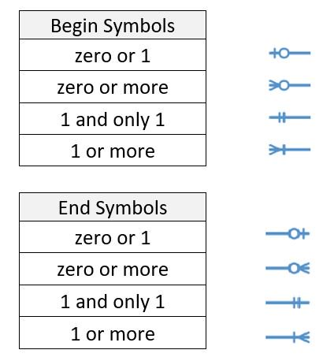
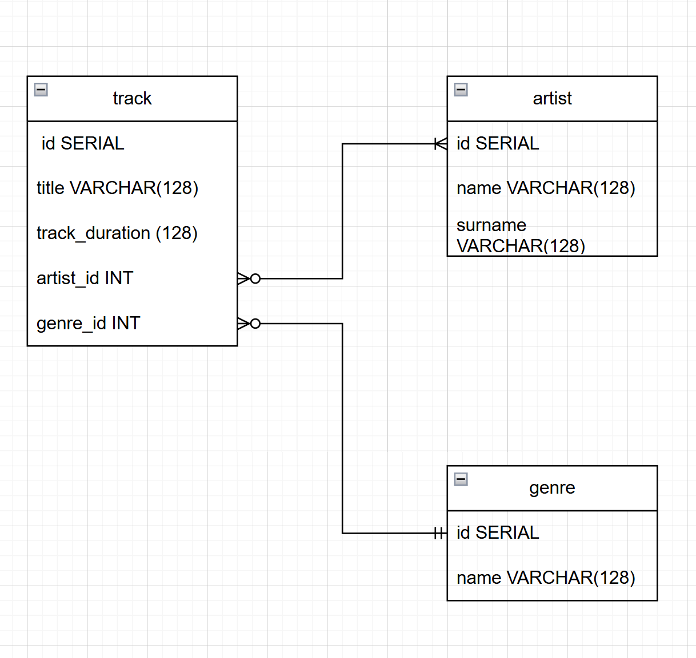

album_id INTEGER REFERENCES album(id) ON DELETE CASCADE,
```postgresql
CREATE USER pg4e WITH PASSWORD 'secret'; 
CREATE DATABASE music WITH OWNER music_admin;

CREATE TABLE artist (
    id SERIAL,
    name VARCHAR(128) NOT NULL,
    surname VARCHAR(128) NOT NULL,
    PRIMARY KEY(id)
);

INSERT INTO artist(name, surname) VALUES ('Tom', 'Morello');
INSERT INTO artist(name, surname) VALUES ('Mike', 'Killer');
INSERT INTO artist(name, surname) VALUES ('B', 'Dolan');
INSERT INTO artist(name, surname) VALUES ('Asap', 'Rock');

CREATE TABLE genre(
    id SERIAL,
    name VARCHAR(128)
);
-- alter my mistake
ALTER TABLE genre 
ADD PRIMARY KEY(id);

ALTER TABLE genre
ADD UNIQUE (name);


INSERT INTO genre (name) VALUES ('metal');
INSERT INTO genre (name) VALUES ('funk');
INSERT INTO genre (name) VALUES ('trapanesee');
INSERT INTO genre (name) VALUES ('rap');
SELECT * FROM genre;

CREATE TABLE track(
    id SERIAL,
    title VARCHAR(128) NOT NULL,
    track_duration INTERVAL NOT NULL,
    artist_id INTEGER REFERENCES artist(id) ON DELETE CASCADE,
    genre_id INTEGER REFERENCES  genre(id)
);

INSERT INTO track (title, track_duration, artist_id, genre_id) VALUES ('Water Tower', '00:03:48', 4, 1);

INSERT INTO track (title, track_duration, artist_id, genre_id) VALUES ('Water Tower', '00:03:48', 36, 1);

-- Using subquerys to query keys and enter them into insert

INSERT INTO track (title, track_duration, artist_id, genre_id)
VALUES (
'High above',
'00:03:48',
(SELECT id FROM artist WHERE "name" = 'Mike' AND "surname" = 'Killer' LIMIT 1),
(SELECT id FROM genre WHERE "name" = 'rap' LIMIT 1)
);
```

